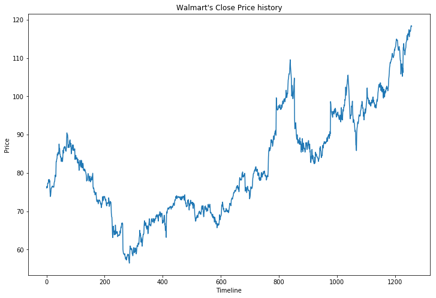
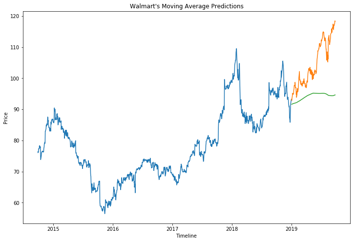
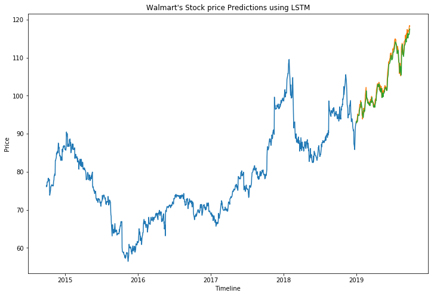

# Machine Learning Stock Predictions project

 To predict futrue stock prices using machine learnig we chose Historical stock prices from Yahoo Finanace. 
 we pulled Last 5 years Stock prices for fortune 500 companies. And we will be finding out the future stock prices for WMT i.e walmart.


```python
#Import python libraries
import pandas as pd
import numpy as np
import matplotlib.pyplot as plt

```


```python
#read the CSV file
WMT_df = pd.read_csv('data/WMT.csv')
```


```python
WMT_df.head()
```


<div>
<style scoped>
    .dataframe tbody tr th:only-of-type {
        vertical-align: middle;
    }

    .dataframe tbody tr th {
        vertical-align: top;
    }

    .dataframe thead th {
        text-align: right;
    }
</style>
<table border="1" class="dataframe">
  <thead>
    <tr style="text-align: right;">
      <th></th>
      <th>Date</th>
      <th>Open</th>
      <th>High</th>
      <th>Low</th>
      <th>Close</th>
      <th>Adj Close</th>
      <th>Volume</th>
    </tr>
  </thead>
  <tbody>
    <tr>
      <th>0</th>
      <td>2014-09-29</td>
      <td>76.059998</td>
      <td>76.250000</td>
      <td>75.650002</td>
      <td>76.080002</td>
      <td>67.061386</td>
      <td>4959300</td>
    </tr>
    <tr>
      <th>1</th>
      <td>2014-09-30</td>
      <td>76.040001</td>
      <td>76.720001</td>
      <td>75.769997</td>
      <td>76.470001</td>
      <td>67.405151</td>
      <td>5640700</td>
    </tr>
    <tr>
      <th>2</th>
      <td>2014-10-01</td>
      <td>76.510002</td>
      <td>76.860001</td>
      <td>75.910004</td>
      <td>76.120003</td>
      <td>67.096642</td>
      <td>6524900</td>
    </tr>
    <tr>
      <th>3</th>
      <td>2014-10-02</td>
      <td>76.209999</td>
      <td>76.910004</td>
      <td>75.959999</td>
      <td>76.230003</td>
      <td>67.193604</td>
      <td>4921200</td>
    </tr>
    <tr>
      <th>4</th>
      <td>2014-10-03</td>
      <td>76.570000</td>
      <td>77.480003</td>
      <td>76.529999</td>
      <td>77.320000</td>
      <td>68.154404</td>
      <td>5819700</td>
    </tr>
  </tbody>
</table>
</div>


```python
WMT_df.info()
```

    <class 'pandas.core.frame.DataFrame'>
    RangeIndex: 1258 entries, 0 to 1257
    Data columns (total 7 columns):
    Date         1258 non-null object
    Open         1258 non-null float64
    High         1258 non-null float64
    Low          1258 non-null float64
    Close        1258 non-null float64
    Adj Close    1258 non-null float64
    Volume       1258 non-null int64
    dtypes: float64(5), int64(1), object(1)
    memory usage: 68.9+ KB
    


```python
# Convert Date to datetime format 
WMT_df["Date"]=pd.to_datetime(WMT_df.Date,format='%Y-%m-%d')
```

The profit or loss calculation is usually determined by the closing price of a stock for the day, hence we will consider the closing price as the target variable. Let’s plot the target variable to understand how it’s shaping up in our data:


```python
# Plot the line chart to see stock prices in last 5 years.
plt.figure(figsize=(12,8))
plt.xlabel('Timeline')
plt.ylabel('Price')
plt.title("Walmart's Close Price history")
plt.plot(df['Close'])
```


    [<matplotlib.lines.Line2D at 0x26226babac8>]





#### Predicitng Stock prices using Moving average 
Moving average is a technique which uses the latest set of values for each prediction. In other words, for each subsequent step, the predicted values are taken into consideration
while removing the oldest observed value from the set


```python
# We need to convert Date column to index 
WMT_df.index = WMT_df['Date']

#create new dataframe with only required columns which Data and Closing price( target variable)
Sorted_StockPrices = WMT_df.sort_index(ascending=True, axis=0)
Mini_WMT_df = WMT_df[['Date', 'Close']].copy()
Mini_WMT_df.head()
```


<div>
<style scoped>
    .dataframe tbody tr th:only-of-type {
        vertical-align: middle;
    }

    .dataframe tbody tr th {
        vertical-align: top;
    }

    .dataframe thead th {
        text-align: right;
    }
</style>
<table border="1" class="dataframe">
  <thead>
    <tr style="text-align: right;">
      <th></th>
      <th>Date</th>
      <th>Close</th>
    </tr>
    <tr>
      <th>Date</th>
      <th></th>
      <th></th>
    </tr>
  </thead>
  <tbody>
    <tr>
      <th>2014-09-29</th>
      <td>2014-09-29</td>
      <td>76.080002</td>
    </tr>
    <tr>
      <th>2014-09-30</th>
      <td>2014-09-30</td>
      <td>76.470001</td>
    </tr>
    <tr>
      <th>2014-10-01</th>
      <td>2014-10-01</td>
      <td>76.120003</td>
    </tr>
    <tr>
      <th>2014-10-02</th>
      <td>2014-10-02</td>
      <td>76.230003</td>
    </tr>
    <tr>
      <th>2014-10-03</th>
      <td>2014-10-03</td>
      <td>77.320000</td>
    </tr>
  </tbody>
</table>
</div>


Now will have to split the data into training and testing datset. We will last 4 years data as a training Data and this years data from 2019 as testing data


```python
WMT_Training_Data= Mini_WMT_df[:1072]
print("WMT_Training_Data shape:",WMT_Training_Data.shape)
WMT_Testing_Data = Mini_WMT_df[1072:]
print("WMT_Testing_Data shape", WMT_Testing_Data.shape)
```

    WMT_Training_Data shape: (1072, 2)
    WMT_Testing_Data shape (186, 2)
    

#### RMSE-Root Mean Square Error
It is a frequently used measure of the differences between values (sample or population values) predicted by a model or an estimator and the values observed.


```python
len(WMT_Training_Data)-186+0
```


    886


```python
#Now we will create prdictions for the Test data set and check the RMSE value using the actual closing prices.
predictions=[]
for i in range(0,WMT_Testing_Data.shape[0]):
    mvg_avg_a=WMT_Training_Data['Close'][len(WMT_Training_Data)-186+i:].sum()+sum(predictions)
    mvg_avg_b= mvg_avg_a/185
    predictions.append(mvg_avg_b)

actualvsPred_DF=pd.DataFrame({"Actual":WMT_Testing_Data['Close'], "Predictions":predictions})
actualvsPred_DF
```


<div>
<style scoped>
    .dataframe tbody tr th:only-of-type {
        vertical-align: middle;
    }

    .dataframe tbody tr th {
        vertical-align: top;
    }

    .dataframe thead th {
        text-align: right;
    }
</style>
<table border="1" class="dataframe">
  <thead>
    <tr style="text-align: right;">
      <th></th>
      <th>Actual</th>
      <th>Predictions</th>
    </tr>
    <tr>
      <th>Date</th>
      <th></th>
      <th></th>
    </tr>
  </thead>
  <tbody>
    <tr>
      <th>2019-01-02</th>
      <td>93.339996</td>
      <td>91.627351</td>
    </tr>
    <tr>
      <th>2019-01-03</th>
      <td>92.860001</td>
      <td>91.654040</td>
    </tr>
    <tr>
      <th>2019-01-04</th>
      <td>93.440002</td>
      <td>91.683088</td>
    </tr>
    <tr>
      <th>2019-01-07</th>
      <td>94.540001</td>
      <td>91.711375</td>
    </tr>
    <tr>
      <th>2019-01-08</th>
      <td>95.199997</td>
      <td>91.742734</td>
    </tr>
    <tr>
      <th>2019-01-09</th>
      <td>94.889999</td>
      <td>91.776857</td>
    </tr>
    <tr>
      <th>2019-01-10</th>
      <td>94.959999</td>
      <td>91.807975</td>
    </tr>
    <tr>
      <th>2019-01-11</th>
      <td>94.839996</td>
      <td>91.834829</td>
    </tr>
    <tr>
      <th>2019-01-14</th>
      <td>94.949997</td>
      <td>91.856099</td>
    </tr>
    <tr>
      <th>2019-01-15</th>
      <td>96.250000</td>
      <td>91.879267</td>
    </tr>
    <tr>
      <th>2019-01-16</th>
      <td>96.349998</td>
      <td>91.900830</td>
    </tr>
    <tr>
      <th>2019-01-17</th>
      <td>96.739998</td>
      <td>91.927429</td>
    </tr>
    <tr>
      <th>2019-01-18</th>
      <td>97.730003</td>
      <td>91.958929</td>
    </tr>
    <tr>
      <th>2019-01-22</th>
      <td>97.489998</td>
      <td>91.988274</td>
    </tr>
    <tr>
      <th>2019-01-23</th>
      <td>98.709999</td>
      <td>92.014319</td>
    </tr>
    <tr>
      <th>2019-01-24</th>
      <td>98.360001</td>
      <td>92.036343</td>
    </tr>
    <tr>
      <th>2019-01-25</th>
      <td>96.940002</td>
      <td>92.061998</td>
    </tr>
    <tr>
      <th>2019-01-28</th>
      <td>97.059998</td>
      <td>92.081469</td>
    </tr>
    <tr>
      <th>2019-01-29</th>
      <td>96.709999</td>
      <td>92.106720</td>
    </tr>
    <tr>
      <th>2019-01-30</th>
      <td>94.800003</td>
      <td>92.137891</td>
    </tr>
    <tr>
      <th>2019-01-31</th>
      <td>95.830002</td>
      <td>92.169826</td>
    </tr>
    <tr>
      <th>2019-02-01</th>
      <td>93.860001</td>
      <td>92.194906</td>
    </tr>
    <tr>
      <th>2019-02-04</th>
      <td>94.769997</td>
      <td>92.231257</td>
    </tr>
    <tr>
      <th>2019-02-05</th>
      <td>95.599998</td>
      <td>92.266345</td>
    </tr>
    <tr>
      <th>2019-02-06</th>
      <td>95.639999</td>
      <td>92.316109</td>
    </tr>
    <tr>
      <th>2019-02-07</th>
      <td>96.730003</td>
      <td>92.368142</td>
    </tr>
    <tr>
      <th>2019-02-08</th>
      <td>95.580002</td>
      <td>92.416726</td>
    </tr>
    <tr>
      <th>2019-02-11</th>
      <td>96.199997</td>
      <td>92.460114</td>
    </tr>
    <tr>
      <th>2019-02-12</th>
      <td>96.970001</td>
      <td>92.503034</td>
    </tr>
    <tr>
      <th>2019-02-13</th>
      <td>97.940002</td>
      <td>92.537483</td>
    </tr>
    <tr>
      <th>...</th>
      <td>...</td>
      <td>...</td>
    </tr>
    <tr>
      <th>2019-08-15</th>
      <td>112.690002</td>
      <td>94.507673</td>
    </tr>
    <tr>
      <th>2019-08-16</th>
      <td>112.989998</td>
      <td>94.480471</td>
    </tr>
    <tr>
      <th>2019-08-19</th>
      <td>113.809998</td>
      <td>94.463122</td>
    </tr>
    <tr>
      <th>2019-08-20</th>
      <td>112.050003</td>
      <td>94.450599</td>
    </tr>
    <tr>
      <th>2019-08-21</th>
      <td>112.019997</td>
      <td>94.452169</td>
    </tr>
    <tr>
      <th>2019-08-22</th>
      <td>111.910004</td>
      <td>94.453695</td>
    </tr>
    <tr>
      <th>2019-08-23</th>
      <td>110.830002</td>
      <td>94.450201</td>
    </tr>
    <tr>
      <th>2019-08-26</th>
      <td>111.989998</td>
      <td>94.446418</td>
    </tr>
    <tr>
      <th>2019-08-27</th>
      <td>112.419998</td>
      <td>94.443210</td>
    </tr>
    <tr>
      <th>2019-08-28</th>
      <td>112.720001</td>
      <td>94.426903</td>
    </tr>
    <tr>
      <th>2019-08-29</th>
      <td>114.080002</td>
      <td>94.411427</td>
    </tr>
    <tr>
      <th>2019-08-30</th>
      <td>114.260002</td>
      <td>94.393921</td>
    </tr>
    <tr>
      <th>2019-09-03</th>
      <td>114.639999</td>
      <td>94.370374</td>
    </tr>
    <tr>
      <th>2019-09-04</th>
      <td>115.910004</td>
      <td>94.362593</td>
    </tr>
    <tr>
      <th>2019-09-05</th>
      <td>115.440002</td>
      <td>94.360391</td>
    </tr>
    <tr>
      <th>2019-09-06</th>
      <td>114.730003</td>
      <td>94.366717</td>
    </tr>
    <tr>
      <th>2019-09-09</th>
      <td>116.330002</td>
      <td>94.369023</td>
    </tr>
    <tr>
      <th>2019-09-10</th>
      <td>116.050003</td>
      <td>94.371829</td>
    </tr>
    <tr>
      <th>2019-09-11</th>
      <td>116.019997</td>
      <td>94.378650</td>
    </tr>
    <tr>
      <th>2019-09-12</th>
      <td>116.919998</td>
      <td>94.386318</td>
    </tr>
    <tr>
      <th>2019-09-13</th>
      <td>117.430000</td>
      <td>94.400028</td>
    </tr>
    <tr>
      <th>2019-09-16</th>
      <td>115.570000</td>
      <td>94.419650</td>
    </tr>
    <tr>
      <th>2019-09-17</th>
      <td>116.510002</td>
      <td>94.437702</td>
    </tr>
    <tr>
      <th>2019-09-18</th>
      <td>117.160004</td>
      <td>94.458716</td>
    </tr>
    <tr>
      <th>2019-09-19</th>
      <td>117.110001</td>
      <td>94.497520</td>
    </tr>
    <tr>
      <th>2019-09-20</th>
      <td>116.980003</td>
      <td>94.537345</td>
    </tr>
    <tr>
      <th>2019-09-23</th>
      <td>117.620003</td>
      <td>94.584466</td>
    </tr>
    <tr>
      <th>2019-09-24</th>
      <td>118.400002</td>
      <td>94.607030</td>
    </tr>
    <tr>
      <th>2019-09-25</th>
      <td>118.470001</td>
      <td>94.623339</td>
    </tr>
    <tr>
      <th>2019-09-26</th>
      <td>118.300003</td>
      <td>94.636816</td>
    </tr>
  </tbody>
</table>
<p>186 rows × 2 columns</p>
</div>


```python

```


```python
# checking the results (RMSE value)
WMT_rmse_mvgavg=np.sqrt(np.mean(np.power((np.array(WMT_Testing_Data['Close'])-predictions),2)))

print("Walmart's Moving Average RMSE:",WMT_rmse_mvgavg)
```

    Walmart's Moving average RMSE: 12.330839504347894
    


```python
#Lets Plot these predctions along with actual price
WMT_Testing_Data['Predictions'] = predictions

plt.figure(figsize=(12,8))
plt.xlabel('Timeline')
plt.ylabel('Price')
plt.title("Walmart's Moving Average Predictions")

plt.plot(WMT_Training_Data['Close'])
plt.plot(WMT_Testing_Data[['Close', 'Predictions']])
```

    C:\Users\Ujwala\Anaconda3\envs\PythonData\lib\site-packages\ipykernel_launcher.py:2: SettingWithCopyWarning: 
    A value is trying to be set on a copy of a slice from a DataFrame.
    Try using .loc[row_indexer,col_indexer] = value instead
    
    See the caveats in the documentation: http://pandas.pydata.org/pandas-docs/stable/indexing.html#indexing-view-versus-copy
      
    


    [<matplotlib.lines.Line2D at 0x262282271d0>,
     <matplotlib.lines.Line2D at 0x26228992198>]





### Linear Regression 


```python
from sklearn.linear_model import LinearRegression
model= LinearRegression()
```


```python
#We will have to convert Date to Unix timestamp 
Mini_WMT_df["Unix_date"]=pd.to_datetime(Mini_WMT_df['Date']).values.astype(np.int64)

Mini_WMT_df.head()
```


<div>
<style scoped>
    .dataframe tbody tr th:only-of-type {
        vertical-align: middle;
    }

    .dataframe tbody tr th {
        vertical-align: top;
    }

    .dataframe thead th {
        text-align: right;
    }
</style>
<table border="1" class="dataframe">
  <thead>
    <tr style="text-align: right;">
      <th></th>
      <th>Date</th>
      <th>Close</th>
      <th>Unix_date</th>
    </tr>
    <tr>
      <th>Date</th>
      <th></th>
      <th></th>
      <th></th>
    </tr>
  </thead>
  <tbody>
    <tr>
      <th>2014-09-29</th>
      <td>2014-09-29</td>
      <td>76.080002</td>
      <td>1411948800000000000</td>
    </tr>
    <tr>
      <th>2014-09-30</th>
      <td>2014-09-30</td>
      <td>76.470001</td>
      <td>1412035200000000000</td>
    </tr>
    <tr>
      <th>2014-10-01</th>
      <td>2014-10-01</td>
      <td>76.120003</td>
      <td>1412121600000000000</td>
    </tr>
    <tr>
      <th>2014-10-02</th>
      <td>2014-10-02</td>
      <td>76.230003</td>
      <td>1412208000000000000</td>
    </tr>
    <tr>
      <th>2014-10-03</th>
      <td>2014-10-03</td>
      <td>77.320000</td>
      <td>1412294400000000000</td>
    </tr>
  </tbody>
</table>
</div>


```python
WMT_LR_trainingData=Mini_WMT_df[:1072]
WMT_LR_testingData=Mini_WMT_df[1072:]
```


```python
print(WMT_LR_trainingData[:10])
```

                     Date      Close            Unix_date
    Date                                                 
    2014-09-29 2014-09-29  76.080002  1411948800000000000
    2014-09-30 2014-09-30  76.470001  1412035200000000000
    2014-10-01 2014-10-01  76.120003  1412121600000000000
    2014-10-02 2014-10-02  76.230003  1412208000000000000
    2014-10-03 2014-10-03  77.320000  1412294400000000000
    2014-10-06 2014-10-06  77.349998  1412553600000000000
    2014-10-07 2014-10-07  77.300003  1412640000000000000
    2014-10-08 2014-10-08  78.239998  1412726400000000000
    2014-10-09 2014-10-09  77.860001  1412812800000000000
    2014-10-10 2014-10-10  78.290001  1412899200000000000
    


```python
x_train=WMT_LR_trainingData[['Unix_date']].copy()
y_train=WMT_LR_trainingData[['Close']].copy()

x_test= WMT_LR_testingData[["Unix_date"]].copy()
y_test=WMT_LR_testingData[['Close']].copy()

```


```python
model.fit(x_train, y_train)

predictions = model.predict(x_test)

rmse_LR = np.sqrt(np.mean(np.power((np.array(y_test) - np.array(predictions)),2)))

print("Linear Regrassion RMSE value: ",rmse_LR)
```

    Linear Regrassion RMSE value:  14.491557243860933
    


```python
predictions
```


    array([[89.58368985],
           [89.5979164 ],
           [89.61214294],
           [89.65482257],
           [89.66904912],
           [89.68327566],
           [89.6975022 ],
           [89.71172875],
           [89.75440838],
           [89.76863492],
           [89.78286147],
           [89.79708801],
           [89.81131456],
           [89.86822073],
           [89.88244727],
           [89.89667382],
           [89.91090036],
           [89.95357999],
           [89.96780654],
           [89.98203308],
           [89.99625963],
           [90.01048617],
           [90.0531658 ],
           [90.06739234],
           [90.08161889],
           [90.09584543],
           [90.11007198],
           [90.15275161],
           [90.16697815],
           [90.1812047 ],
           [90.19543124],
           [90.20965778],
           [90.26656396],
           [90.2807905 ],
           [90.29501705],
           [90.30924359],
           [90.35192322],
           [90.36614977],
           [90.38037631],
           [90.39460285],
           [90.4088294 ],
           [90.45150903],
           [90.46573557],
           [90.47996212],
           [90.49418866],
           [90.5084152 ],
           [90.55109484],
           [90.56532138],
           [90.57954792],
           [90.59377447],
           [90.60800101],
           [90.65068064],
           [90.66490719],
           [90.67913373],
           [90.69336027],
           [90.70758682],
           [90.75026645],
           [90.76449299],
           [90.77871954],
           [90.79294608],
           [90.80717263],
           [90.84985226],
           [90.8640788 ],
           [90.87830535],
           [90.89253189],
           [90.90675843],
           [90.94943806],
           [90.96366461],
           [90.97789115],
           [90.9921177 ],
           [91.00634424],
           [91.04902387],
           [91.06325042],
           [91.07747696],
           [91.0917035 ],
           [91.14860968],
           [91.16283622],
           [91.17706277],
           [91.19128931],
           [91.20551585],
           [91.24819549],
           [91.26242203],
           [91.27664857],
           [91.29087512],
           [91.30510166],
           [91.34778129],
           [91.36200784],
           [91.37623438],
           [91.39046092],
           [91.40468747],
           [91.4473671 ],
           [91.46159364],
           [91.47582019],
           [91.49004673],
           [91.50427328],
           [91.54695291],
           [91.56117945],
           [91.57540599],
           [91.58963254],
           [91.60385908],
           [91.66076526],
           [91.6749918 ],
           [91.68921835],
           [91.70344489],
           [91.74612452],
           [91.76035106],
           [91.77457761],
           [91.78880415],
           [91.8030307 ],
           [91.84571033],
           [91.85993687],
           [91.87416342],
           [91.88838996],
           [91.9026165 ],
           [91.94529614],
           [91.95952268],
           [91.97374922],
           [91.98797577],
           [92.00220231],
           [92.04488194],
           [92.05910849],
           [92.07333503],
           [92.08756157],
           [92.10178812],
           [92.14446775],
           [92.15869429],
           [92.17292084],
           [92.20137392],
           [92.24405356],
           [92.2582801 ],
           [92.27250664],
           [92.28673319],
           [92.30095973],
           [92.34363936],
           [92.35786591],
           [92.37209245],
           [92.386319  ],
           [92.40054554],
           [92.44322517],
           [92.45745171],
           [92.47167826],
           [92.4859048 ],
           [92.50013135],
           [92.54281098],
           [92.55703752],
           [92.57126407],
           [92.58549061],
           [92.59971715],
           [92.64239678],
           [92.65662333],
           [92.67084987],
           [92.68507642],
           [92.69930296],
           [92.74198259],
           [92.75620914],
           [92.77043568],
           [92.78466222],
           [92.79888877],
           [92.8415684 ],
           [92.85579494],
           [92.87002149],
           [92.88424803],
           [92.89847457],
           [92.94115421],
           [92.95538075],
           [92.96960729],
           [92.98383384],
           [92.99806038],
           [93.05496656],
           [93.0691931 ],
           [93.08341964],
           [93.09764619],
           [93.14032582],
           [93.15455236],
           [93.16877891],
           [93.18300545],
           [93.197232  ],
           [93.23991163],
           [93.25413817],
           [93.26836471],
           [93.28259126],
           [93.2968178 ],
           [93.33949743],
           [93.35372398],
           [93.36795052],
           [93.38217707]])


```python
WMT_LR_testingData['Predictions'] = predictions

plt.figure(figsize=(12,8))
plt.xlabel('Timeline')
plt.ylabel('Price')
plt.title("Walmart's Stock price Predictions using Linear Regression")

plt.plot(WMT_LR_trainingData[['Close']])
plt.plot(WMT_LR_testingData[['Close', 'Predictions']])
```

    C:\Users\Ujwala\Anaconda3\envs\PythonData\lib\site-packages\ipykernel_launcher.py:1: SettingWithCopyWarning: 
    A value is trying to be set on a copy of a slice from a DataFrame.
    Try using .loc[row_indexer,col_indexer] = value instead
    
    See the caveats in the documentation: http://pandas.pydata.org/pandas-docs/stable/indexing.html#indexing-view-versus-copy
      """Entry point for launching an IPython kernel.
    


    [<matplotlib.lines.Line2D at 0x262307911d0>,
     <matplotlib.lines.Line2D at 0x26230791080>]


### LSTM Model
LSTMs are widely used for sequence prediction problems and have proven to be extremely effective. The reason they work so well is because LSTM is able to store past information that is important, and forget the information that is not


```python
#importing required libraries
from sklearn.preprocessing import MinMaxScaler

# Importing the Keras libraries and packages
from keras.models import Sequential
from keras.layers import Dense
from keras.layers import LSTM
from keras.layers import Dropout
```


```python
LSTM_DF=Mini_WMT_df.copy()

LSTM_DF.drop('Date', axis=1, inplace=True)
LSTM_DF.drop('Unix_date', axis=1, inplace=True)
LSTM_DF_dataset =LSTM_DF.values
LSTM_DF_dataset
```


    array([[ 76.080002],
           [ 76.470001],
           [ 76.120003],
           ...,
           [118.400002],
           [118.470001],
           [118.300003]])


```python
LTSM_train = LSTM_DF_dataset[0:1072,:]
LTSM_test = LSTM_DF_dataset[1072:,:]
```


```python
#Convert the prices into scaled data 

scaler = MinMaxScaler(feature_range=(0, 1))
scaled_data = scaler.fit_transform(LSTM_DF_dataset)
scaled_data
```


    array([[0.31684131],
           [0.32312654],
           [0.31748596],
           ...,
           [0.99887189],
           [1.        ],
           [0.99726031]])


```python
x_train, y_train = [], []
for i in range(60,len(LTSM_train)):
    x_train.append(scaled_data[i-60:i,0])
    y_train.append(scaled_data[i,0])
x_train, y_train = np.array(x_train), np.array(y_train)

x_train = np.reshape(x_train, (x_train.shape[0],x_train.shape[1],1))
```


```python
# create and fit the LSTM network
regressor = Sequential()

# Adding the first LSTM layer and some Dropout regularisation
regressor.add(LSTM(units = 50, return_sequences = True, input_shape = (x_train.shape[1], 1)))
regressor.add(Dropout(0.2))
              
# Adding a second LSTM layer and some Dropout regularisation
regressor.add(LSTM(units = 50, return_sequences = True))
regressor.add(Dropout(0.2))

# Adding a third LSTM layer and some Dropout regularisation
regressor.add(LSTM(units = 50, return_sequences = True))
regressor.add(Dropout(0.2))

# Adding a fourth LSTM layer and some Dropout regularisation
regressor.add(LSTM(units = 50))
regressor.add(Dropout(0.2))

# Adding the output layer
regressor.add(Dense(units = 1))

# Compiling the RNN
regressor.compile(optimizer = 'adam', loss = 'mean_squared_error')

# Fitting the RNN to the Training set
regressor.fit(x_train, y_train, epochs = 5, batch_size = 40)

```

    WARNING:tensorflow:From C:\Users\Ujwala\Anaconda3\envs\PythonData\lib\site-packages\keras\backend\tensorflow_backend.py:3733: calling dropout (from tensorflow.python.ops.nn_ops) with keep_prob is deprecated and will be removed in a future version.
    Instructions for updating:
    Please use `rate` instead of `keep_prob`. Rate should be set to `rate = 1 - keep_prob`.
    Epoch 1/5
    1012/1012 [==============================] - 6s 6ms/step - loss: 0.0370
    Epoch 2/5
    1012/1012 [==============================] - 3s 3ms/step - loss: 0.0058
    Epoch 3/5
    1012/1012 [==============================] - 3s 3ms/step - loss: 0.0042
    Epoch 4/5
    1012/1012 [==============================] - 3s 3ms/step - loss: 0.0039
    Epoch 5/5
    1012/1012 [==============================] - 3s 3ms/step - loss: 0.0038
    


    <keras.callbacks.History at 0x26249856f28>


```python

```


```python
# predicting Test data stock prices, using past 60 days stock prices from the train data
inputs = LSTM_DF[len(LSTM_DF) - len(LTSM_test) - 60:].values
inputs = inputs.reshape(-1,1)
inputs  = scaler.transform(inputs)
inputs
```


    array([[0.60902497],
           [0.59452052],
           [0.61676071],
           [0.65527803],
           [0.63400487],
           [0.6043513 ],
           [0.61869457],
           [0.60273973],
           [0.63481061],
           [0.64689763],
           [0.64061238],
           [0.65640616],
           [0.65624495],
           [0.6668816 ],
           [0.66301367],
           [0.68912167],
           [0.68525386],
           [0.69911366],
           [0.7413376 ],
           [0.7068493 ],
           [0.71168416],
           [0.72393225],
           [0.74923455],
           [0.75600325],
           [0.77195809],
           [0.78098302],
           [0.79194194],
           [0.76470593],
           [0.749718  ],
           [0.72699434],
           [0.69492346],
           [0.66510882],
           [0.65044318],
           [0.60821925],
           [0.60838031],
           [0.62336822],
           [0.62417409],
           [0.62240131],
           [0.66140208],
           [0.65866239],
           [0.66446417],
           [0.68219178],
           [0.63481061],
           [0.61804991],
           [0.59258666],
           [0.60467369],
           [0.60322318],
           [0.59129736],
           [0.58887992],
           [0.57099111],
           [0.55358578],
           [0.55858183],
           [0.55004034],
           [0.49734085],
           [0.49492341],
           [0.47381145],
           [0.54778412],
           [0.56680091],
           [0.57550358],
           [0.59194202],
           [0.59500397],
           [0.58726835],
           [0.59661567],
           [0.61434329],
           [0.62497981],
           [0.61998387],
           [0.62111199],
           [0.61917802],
           [0.6209508 ],
           [0.64190169],
           [0.64351326],
           [0.64979852],
           [0.66575347],
           [0.66188554],
           [0.68154712],
           [0.67590654],
           [0.65302179],
           [0.65495565],
           [0.64931505],
           [0.61853349],
           [0.63513299],
           [0.60338439],
           [0.61804991],
           [0.63142624],
           [0.6320709 ],
           [0.64963744],
           [0.63110398],
           [0.64109584],
           [0.65350525],
           [0.66913782],
           [0.67848504],
           [0.70217563],
           [0.73779205],
           [0.70040285],
           [0.69250603],
           [0.69508466],
           [0.68815476],
           [0.68122485],
           [0.67187753],
           [0.6860596 ],
           [0.66897663],
           [0.66768732],
           [0.67558414],
           [0.67429496],
           [0.66124089],
           [0.66349712],
           [0.6778405 ],
           [0.67606774],
           [0.68670425],
           [0.6736503 ],
           [0.67687346],
           [0.69685744],
           [0.69991939],
           [0.680419  ],
           [0.68718772],
           [0.67461723],
           [0.67284445],
           [0.67526189],
           [0.65737307],
           [0.65608376],
           [0.6625302 ],
           [0.66720387],
           [0.65302179],
           [0.6570508 ],
           [0.67187753],
           [0.6834811 ],
           [0.68992753],
           [0.68122485],
           [0.69589038],
           [0.7152297 ],
           [0.72747781],
           [0.74149879],
           [0.74955681],
           [0.75326356],
           [0.75358581],
           [0.74053187],
           [0.75181305],
           [0.75922641],
           [0.75906522],
           [0.72699434],
           [0.72747781],
           [0.7481063 ],
           [0.72425465],
           [0.7208703 ],
           [0.73585821],
           [0.74198225],
           [0.72328772],
           [0.70717168],
           [0.69492346],
           [0.73311851],
           [0.70056404],
           [0.70701049],
           [0.70040285],
           [0.7234488 ],
           [0.71619663],
           [0.72683315],
           [0.72038683],
           [0.73827563],
           [0.73231266],
           [0.7453666 ],
           [0.7413376 ],
           [0.73650287],
           [0.73763097],
           [0.72554395],
           [0.73392424],
           [0.74359384],
           [0.77356966],
           [0.78468978],
           [0.79999996],
           [0.82352936],
           [0.83029817],
           [0.84448025],
           [0.84174056],
           [0.84850926],
           [0.84995977],
           [0.85785659],
           [0.85737313],
           [0.8686543 ],
           [0.88170824],
           [0.88348102],
           [0.87510073],
           [0.8660758 ],
           [0.86510874],
           [0.87139399],
           [0.87348916],
           [0.88928279],
           [0.90088637],
           [0.89540697],
           [0.9073328 ],
           [0.9099113 ],
           [0.911523  ],
           [0.92667199],
           [0.9376309 ],
           [0.94375507],
           [0.94020953],
           [0.9376309 ],
           [0.93956487],
           [0.92634974],
           [0.90894439],
           [0.89717962],
           [0.89572924],
           [0.89927478],
           [0.91216755],
           [0.90008052],
           [0.89669617],
           [0.86962122],
           [0.85350518],
           [0.85382758],
           [0.79613215],
           [0.81950035],
           [0.83448826],
           [0.83964539],
           [0.81966154],
           [0.78646254],
           [0.8217567 ],
           [0.80225619],
           [0.90684934],
           [0.91168408],
           [0.92489923],
           [0.89653509],
           [0.89605151],
           [0.89427886],
           [0.87687351],
           [0.89556805],
           [0.90249794],
           [0.9073328 ],
           [0.92925062],
           [0.93215151],
           [0.93827555],
           [0.958743  ],
           [0.95116843],
           [0.93972606],
           [0.9655117 ],
           [0.96099923],
           [0.96051565],
           [0.9750201 ],
           [0.98323931],
           [0.95326348],
           [0.96841259],
           [0.97888804],
           [0.97808219],
           [0.97598714],
           [0.9863014 ],
           [0.99887189],
           [1.        ],
           [0.99726031]])


```python
X_test = []
for i in range(60,inputs.shape[0]):
    X_test.append(inputs[i-60:i,0])
X_test = np.array(X_test)
X_test = np.reshape(X_test, (X_test.shape[0],X_test.shape[1],1))
closing_price = regressor.predict(X_test)
closing_price = scaler.inverse_transform(closing_price)
X_test
```


```python
LSTM_rmse=np.sqrt(np.mean(np.power((LTSM_test-closing_price),2)))
LSTM_rmse
```


    1.20648045565731


```python
closing_price
```


    array([[ 92.884895],
           [ 93.34196 ],
           [ 93.110916],
           [ 93.24126 ],
           [ 93.9908  ],
           [ 94.77725 ],
           [ 94.899506],
           [ 94.89248 ],
           [ 94.77904 ],
           [ 94.77862 ],
           [ 95.601524],
           [ 96.09631 ],
           [ 96.49554 ],
           [ 97.253586],
           [ 97.42137 ],
           [ 98.177635],
           [ 98.29099 ],
           [ 97.327675],
           [ 96.89072 ],
           [ 96.55652 ],
           [ 95.25282 ],
           [ 95.29021 ],
           [ 94.25898 ],
           [ 94.31403 ],
           [ 95.00118 ],
           [ 95.40588 ],
           [ 96.2255  ],
           [ 95.8663  ],
           [ 95.95532 ],
           [ 96.510345],
           [ 97.39741 ],
           [ 98.14894 ],
           [ 99.3562  ],
           [101.29648 ],
           [100.53414 ],
           [ 99.56656 ],
           [ 99.24307 ],
           [ 98.9119  ],
           [ 98.52525 ],
           [ 98.01766 ],
           [ 98.39587 ],
           [ 97.97979 ],
           [ 97.693275],
           [ 97.917206],
           [ 98.0216  ],
           [ 97.535965],
           [ 97.37    ],
           [ 97.91373 ],
           [ 98.14508 ],
           [ 98.62531 ],
           [ 98.30592 ],
           [ 98.208275],
           [ 98.98704 ],
           [ 99.51015 ],
           [ 98.88542 ],
           [ 98.77279 ],
           [ 98.273544],
           [ 97.97395 ],
           [ 97.987526],
           [ 97.3326  ],
           [ 96.965706],
           [ 97.12193 ],
           [ 97.44636 ],
           [ 97.04392 ],
           [ 96.963715],
           [ 97.55475 ],
           [ 98.33156 ],
           [ 98.910576],
           [ 98.741714],
           [ 99.15534 ],
           [100.143616],
           [101.072014],
           [101.96595 ],
           [102.58784 ],
           [102.89322 ],
           [102.93788 ],
           [102.34618 ],
           [102.514145],
           [102.96483 ],
           [103.15589 ],
           [101.85495 ],
           [101.24206 ],
           [101.95513 ],
           [101.40437 ],
           [100.94366 ],
           [101.40679 ],
           [101.9474  ],
           [101.38911 ],
           [100.3973  ],
           [ 99.485016],
           [100.72253 ],
           [100.12791 ],
           [ 99.98161 ],
           [ 99.70639 ],
           [100.53381 ],
           [100.679695],
           [101.09124 ],
           [100.99394 ],
           [101.6224  ],
           [101.67535 ],
           [102.157715],
           [102.19758 ],
           [101.947426],
           [101.85775 ],
           [101.339325],
           [101.45237 ],
           [101.97246 ],
           [103.46872 ],
           [104.585754],
           [105.56011 ],
           [106.841484],
           [107.54548 ],
           [108.27    ],
           [108.32521 ],
           [108.51268 ],
           [108.611855],
           [108.958435],
           [109.05893 ],
           [109.54984 ],
           [110.31547 ],
           [110.64839 ],
           [110.30216 ],
           [109.690125],
           [109.4137  ],
           [109.647736],
           [109.88592 ],
           [110.67647 ],
           [111.502754],
           [111.49591 ],
           [111.90819 ],
           [112.1629  ],
           [112.270454],
           [112.9529  ],
           [113.70052 ],
           [114.18482 ],
           [114.09723 ],
           [113.85326 ],
           [113.8285  ],
           [113.2284  ],
           [112.20176 ],
           [111.338356],
           [111.066154],
           [111.25221 ],
           [111.9824  ],
           [111.740166],
           [111.41112 ],
           [110.08205 ],
           [108.86437 ],
           [108.53894 ],
           [106.06912 ],
           [106.107796],
           [107.096085],
           [107.82204 ],
           [107.18668 ],
           [105.39244 ],
           [106.17808 ],
           [105.906044],
           [110.29389 ],
           [112.50817 ],
           [113.488625],
           [112.211975],
           [111.446075],
           [111.12934 ],
           [110.29687 ],
           [110.84441 ],
           [111.50172 ],
           [111.95331 ],
           [113.0576  ],
           [113.56906 ],
           [113.89728 ],
           [114.870346],
           [114.82649 ],
           [114.131165],
           [115.02104 ],
           [115.22428 ],
           [115.17552 ],
           [115.790825],
           [116.40365 ],
           [115.15175 ],
           [115.288   ],
           [115.95768 ],
           [116.17531 ],
           [116.08433 ],
           [116.49427 ],
           [117.23979 ],
           [117.51729 ]], dtype=float32)


```python
#for plotting
LTSM_train = LSTM_DF[:1072]
LTSM_Test = LSTM_DF[1072:]
LTSM_Test['Predictions'] = closing_price

plt.figure(figsize=(12,8))
plt.xlabel('Timeline')
plt.ylabel('Price')

plt.title("Walmart's Stock price Predictions using LSTM")
plt.plot(LTSM_train['Close'])
plt.plot(LTSM_Test[['Close','Predictions']])
```

    C:\Users\Ujwala\Anaconda3\envs\PythonData\lib\site-packages\ipykernel_launcher.py:4: SettingWithCopyWarning: 
    A value is trying to be set on a copy of a slice from a DataFrame.
    Try using .loc[row_indexer,col_indexer] = value instead
    
    See the caveats in the documentation: http://pandas.pydata.org/pandas-docs/stable/indexing.html#indexing-view-versus-copy
      after removing the cwd from sys.path.
    


    [<matplotlib.lines.Line2D at 0x26252aeff98>,
     <matplotlib.lines.Line2D at 0x26252af8128>]





```python

```
